# LifeFlow Blood Bank Management System

> A modern, full-featured frontend for managing blood bank operations — donors, inventory, donation camps, requests, TTI screening, thalassemia patients, and more. Built for Pakistan's healthcare context.

**Live Repo:** [github.com/Aizaz-Noor/LifeFlow-BloodBank-Frontend](https://github.com/Aizaz-Noor/LifeFlow-BloodBank-Frontend)

---

## 📸 Screenshots

### 🌐 Public Landing Page

| Hero Section | Blood Statistics |
|:---:|:---:|
| 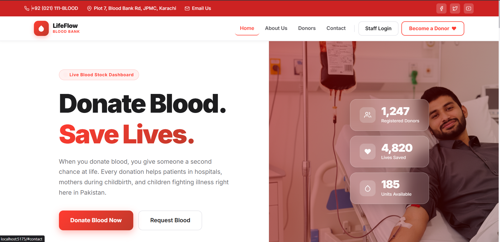 | 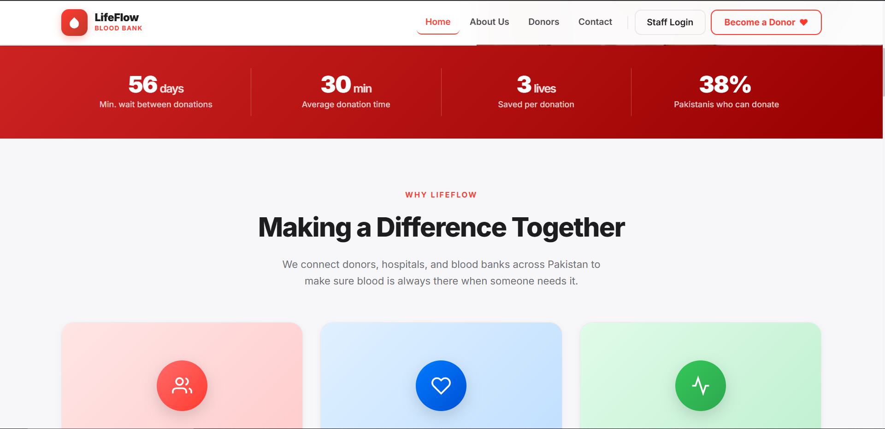 |

| Features | Testimonials |
|:---:|:---:|
| 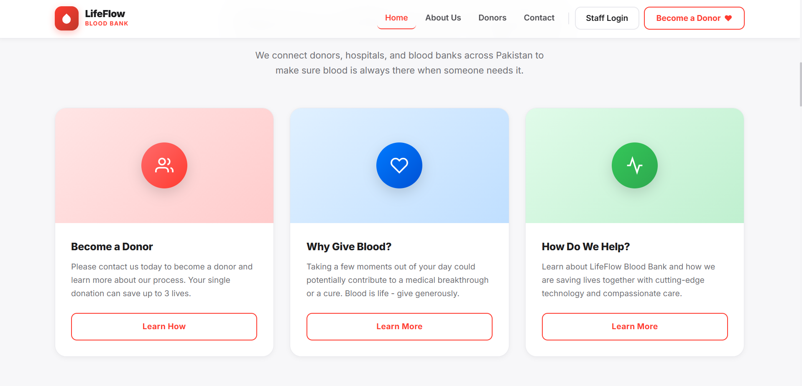 | 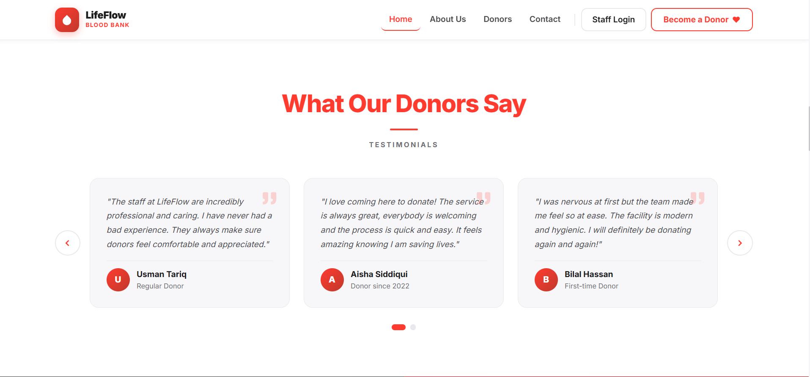 |

| Quality Promise | How to Donate |
|:---:|:---:|
| 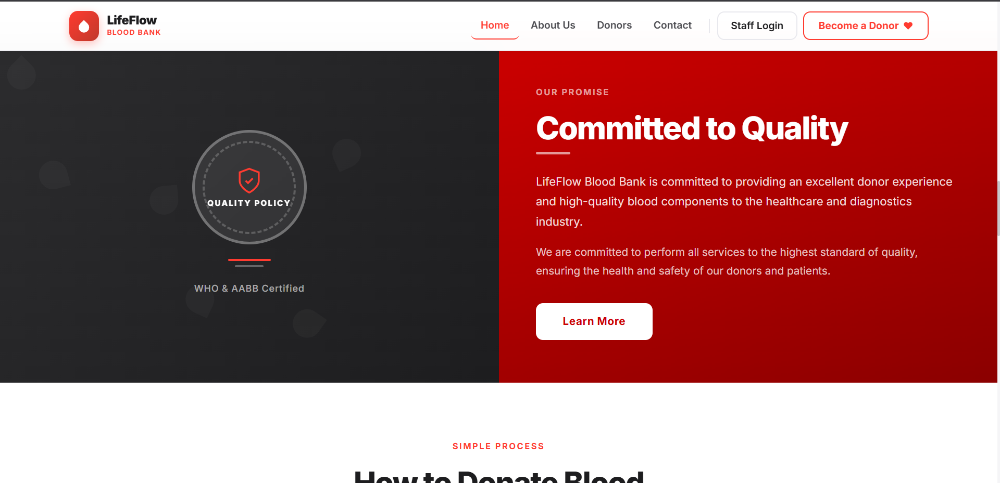 | 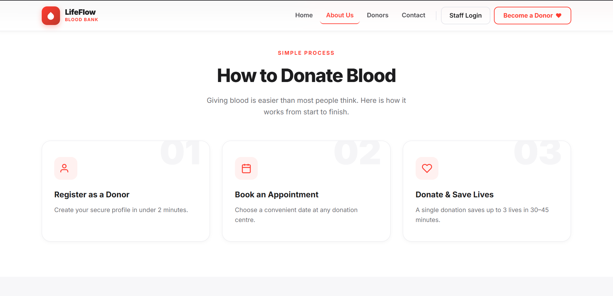 |

| Real-Time Blood Availability | About Page |
|:---:|:---:|
| 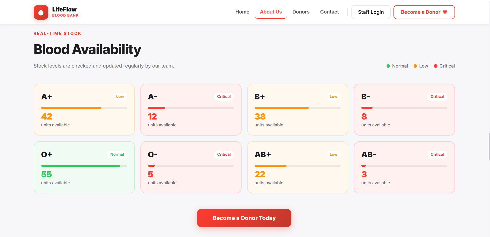 | 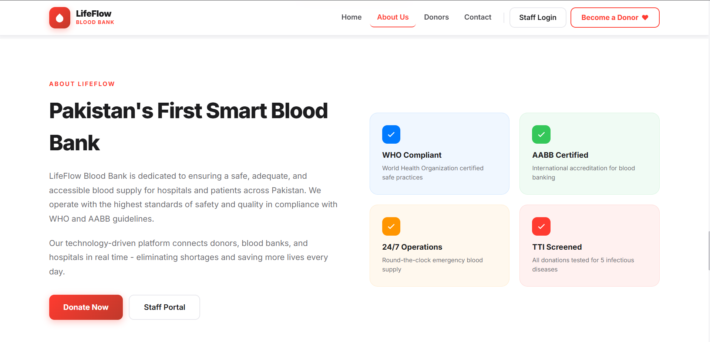 |

| Contact Page | Footer |
|:---:|:---:|
| 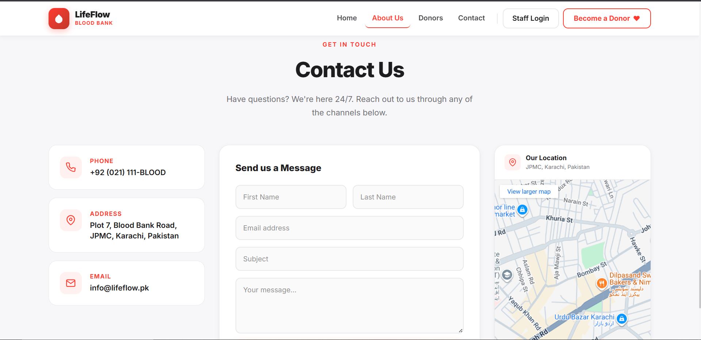 | 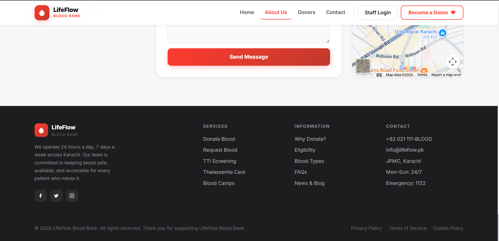 |

---

### 🔐 Staff Portal

| Login | Dashboard |
|:---:|:---:|
| 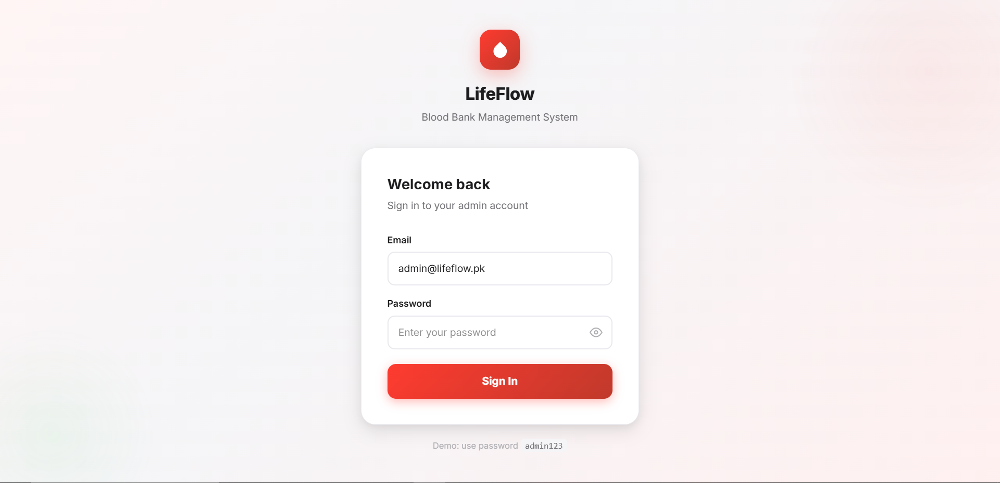 | 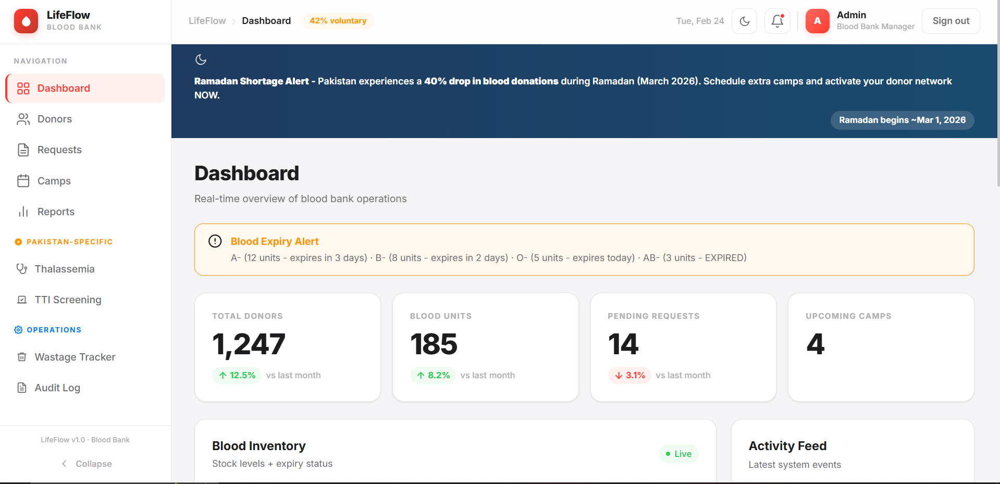 |

| Donor Management | Blood Requests |
|:---:|:---:|
| 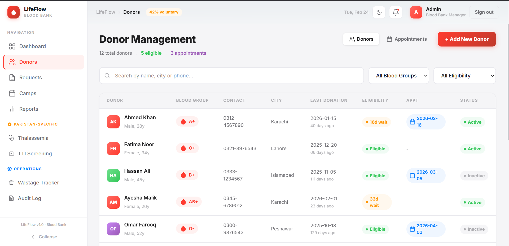 | 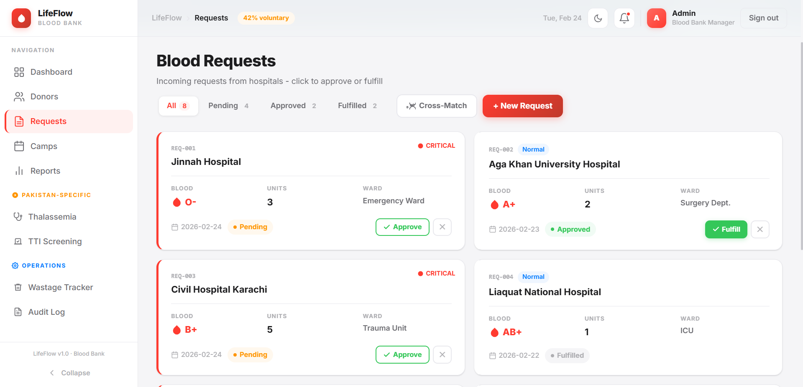 |

| Donation Camps | Reports & Analytics |
|:---:|:---:|
| 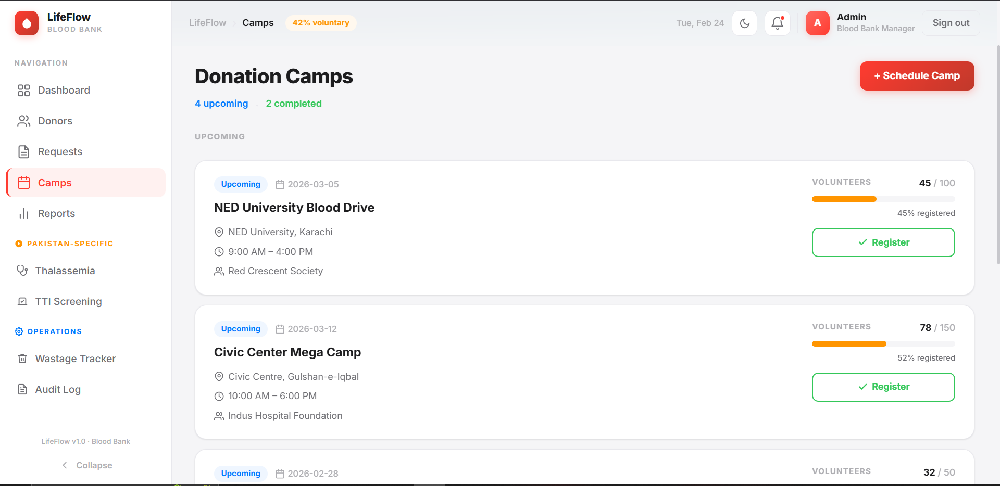 | 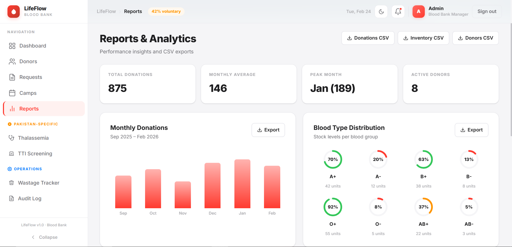 |

| Thalassemia Module (Dark Mode) | TTI Screening (Dark Mode) |
|:---:|:---:|
| 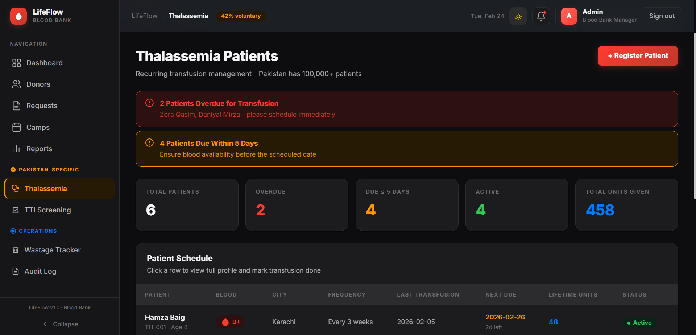 | 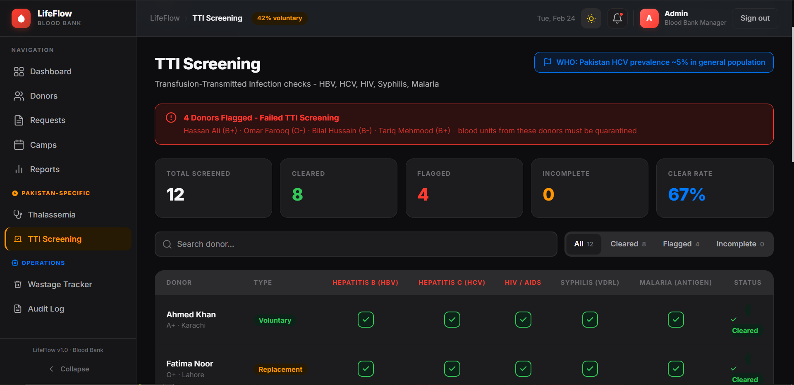 |

| Blood Wastage Tracker | Audit Log |
|:---:|:---:|
| 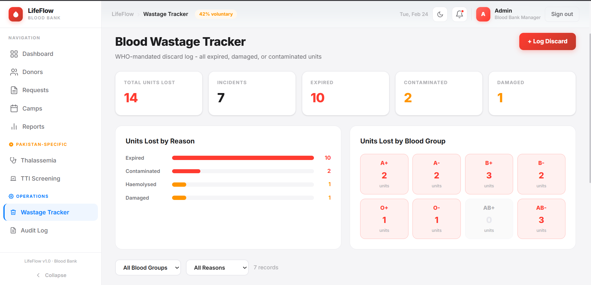 | 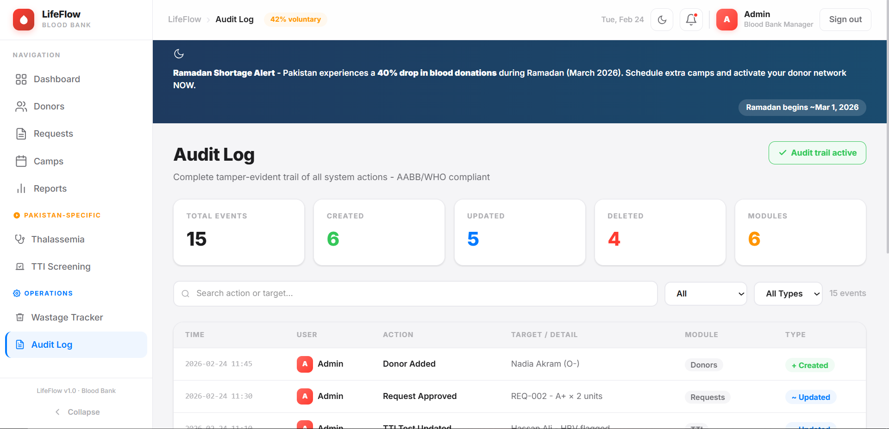 |

---

## Tech Stack

| Technology | Version |
|---|---|
| React | 19.x |
| Vite | 6.x |
| Tailwind CSS | 4.x |
| JavaScript (JSX) | ES Modules |

---

## Project Structure

```
BloodBank-Frontend/
├── public/
│   └── screenshots/          # App screenshots (used in README)
├── src/
│   ├── lib/                  # Shared utilities
│   │   ├── data.js           # Mock data & business logic helpers
│   │   └── icons.jsx         # Centralized SVG icon library
│   ├── components/
│   │   └── common/           # Reusable layout components
│   │       ├── Sidebar.jsx   # Navigation sidebar
│   │       ├── TopBar.jsx    # Header with dark mode + notifications
│   │       └── NotifPanel.jsx# Sliding notification panel
│   ├── pages/                # Feature pages
│   │   ├── Home.jsx          # Public landing page
│   │   ├── Login.jsx         # Authentication
│   │   ├── Dashboard.jsx     # Admin KPI overview
│   │   ├── Donors.jsx        # Donor management
│   │   ├── Requests.jsx      # Blood request tracking
│   │   ├── Camps.jsx         # Donation camp scheduling
│   │   ├── Reports.jsx       # Analytics & CSV export
│   │   ├── Thalassemia.jsx   # Thalassemia patient registry
│   │   ├── TTIScreening.jsx  # Infection screening module
│   │   ├── Wastage.jsx       # Blood wastage tracker
│   │   ├── AuditLog.jsx      # System audit trail
│   │   └── modals/           # Modal dialogs per feature
│   │       ├── AddDonorModal.jsx
│   │       ├── AddCampModal.jsx
│   │       └── AddRequestModal.jsx
│   ├── App.jsx               # Root orchestrator (~90 lines)
│   └── index.css             # Global styles & CSS variables
├── index.html
├── vite.config.js
└── package.json
```

---

## Features

- 🔐 **Authentication** — Login / Signup with role-based views
- 📊 **Dashboard** — Real-time blood inventory KPIs
- 👥 **Donor Management** — Add, edit, search, and filter donors
- 📋 **Blood Requests** — Track and fulfil incoming blood requests
- 🏕️ **Camp Management** — Schedule and manage donation camps
- 🧪 **TTI Screening** — Track Transfusion-Transmissible Infection tests
- 🧬 **Thalassemia Module** — Dedicated patient management
- 📉 **Wastage Tracking** — Log and analyze blood unit wastage
- 📝 **Audit Log** — Full system activity trail
- 📈 **Reports** — Exportable analytics and statistics
- 🏠 **Public Home Page** — Donor recruitment landing page

---

## Getting Started

### Prerequisites

- [Node.js](https://nodejs.org/) v18+
- npm v9+

### Installation

```bash
# Clone the repository
git clone https://github.com/Aizaz-Noor/LifeFlow-BloodBank-Frontend.git
cd LifeFlow-BloodBank-Frontend

# Install dependencies
npm install

# Start development server
npm run dev
```

Open [http://localhost:5173](http://localhost:5173) in your browser.

**Demo login:** Email: `admin@lifeflow.pk` | Password: `admin123`

### Build for Production

```bash
npm run build
npm run preview
```

---

## 📸 Screenshots

> Dashboard, Donor Management, and Audit Log screenshots can be found in the `docs/` folder (coming soon).

---

##  Author

**Aizaz Noor** — Software Engineering, Semester 3  
📧 aizaznoorkhuwaja@gmail.com

---

## 📄 License

This project is for academic purposes — **LifeFlow Blood Bank Management System** (University Project).
