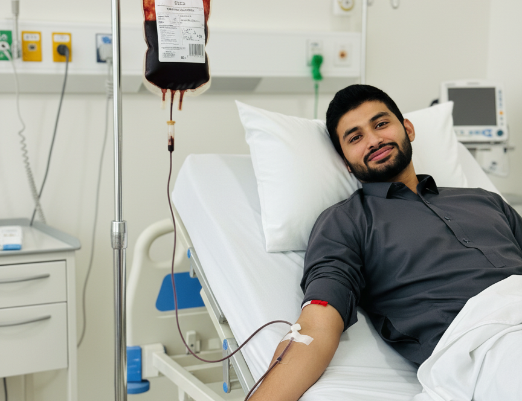

# 🩸 LifeFlow — Blood Bank Management System

> A modern, full-featured frontend for managing blood bank operations — donors, inventory, donation camps, requests, TTI screening, and more.



---

## 🚀 Tech Stack

| Technology | Version |
|---|---|
| React | 19.x |
| Vite | 6.x |
| Tailwind CSS | 4.x |
| JavaScript (JSX) | ES Modules |

---

## 📁 Project Structure

```
BloodBank-Frontend/
├── public/               # Static assets (hero image, etc.)
├── src/
│   ├── components/
│   │   ├── common/       # Navbar, Sidebar, Footer
│   │   ├── layouts/      # SidebarLayout
│   │   └── ui/           # Reusable Button, Input components
│   ├── pages/            # Login, Signup, RepInbox pages
│   ├── App.jsx           # Root app with routing & state
│   ├── Dashboard.jsx     # Admin dashboard overview
│   ├── Donors.jsx        # Donor management
│   ├── Requests.jsx      # Blood request management
│   ├── Camps.jsx         # Donation camp scheduling
│   ├── AuditLog.jsx      # System audit trail
│   ├── Reports.jsx       # Analytics & reports
│   ├── TTIScreening.jsx  # TTI test screening module
│   ├── Thalassemia.jsx   # Thalassemia patient tracking
│   ├── Wastage.jsx       # Blood wastage tracking
│   ├── Home.jsx          # Public-facing home page
│   ├── Login.jsx         # Authentication page
│   ├── icons.jsx         # Centralized SVG icon library
│   ├── data.js           # Mock / seed data
│   └── index.css         # Global styles
├── index.html
├── vite.config.js
└── package.json
```

---

## ✨ Features

- 🔐 **Authentication** — Login / Signup with role-based views
- 📊 **Dashboard** — Real-time blood inventory KPIs
- 👥 **Donor Management** — Add, edit, search, and filter donors
- 📋 **Blood Requests** — Track and fulfil incoming blood requests
- 🏕️ **Camp Management** — Schedule and manage donation camps
- 🧪 **TTI Screening** — Track Transfusion-Transmissible Infection tests
- 🧬 **Thalassemia Module** — Dedicated patient management
- 📉 **Wastage Tracking** — Log and analyze blood unit wastage
- 📝 **Audit Log** — Full system activity trail
- 📈 **Reports** — Exportable analytics and statistics
- 🏠 **Public Home Page** — Donor recruitment landing page

---

## 🛠️ Getting Started

### Prerequisites

- [Node.js](https://nodejs.org/) v18+
- npm v9+

### Installation

```bash
# Clone the repository
git clone https://github.com/Aizaz-Noor/LifeFlow-BloodBank.git
cd LifeFlow-BloodBank

# Install dependencies
npm install

# Start development server
npm run dev
```

Open [http://localhost:5173](http://localhost:5173) in your browser.

### Build for Production

```bash
npm run build
npm run preview
```

---

## 📸 Screenshots

> Dashboard, Donor Management, and Audit Log screenshots can be found in the `docs/` folder (coming soon).

---

## 👨‍💻 Author

**Aizaz Noor** — Software Engineering, Semester 3  
📧 aizaznoorkhuwaja@gmail.com

---

## 📄 License

This project is for academic purposes — **LifeFlow Blood Bank Management System** (University Project).
